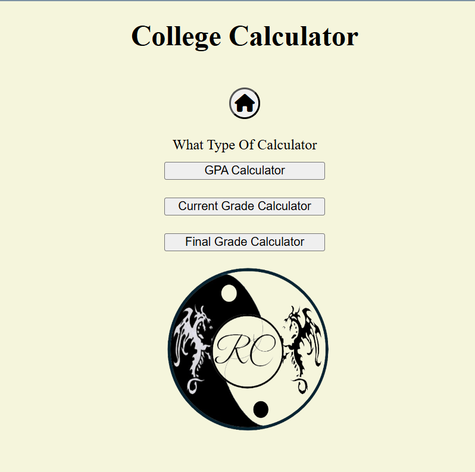

This is a calculator that can help you keep track of your overall GPA without having to constantly loggin to your school page to check. 
It also has a current grade tracker that help you keep track of your class standing without having you to manually calculating or asking the professor

This website was build using HTML,CSS, and Javascript and it prioritize localStorage in order to access and retrieve data in order to use it. 

The public website is right [here](https://thecollegecalculator.netlify.app/)

If you want to use this, download the zip file, extract it, and just open the folder on any ide that supports JS, HTML, and CSS and just run any html file you want.
